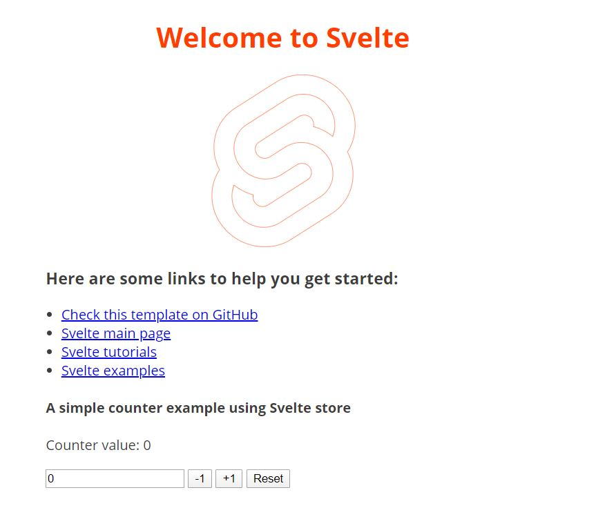

# Svelte webpack-babel-scss app

This is a project template for [Svelte](https://svelte.dev) apps. It lives at https://github.com/markoboy/svelte-webpack-babel-scss. It is an expansion of https://github.com/sveltejs/template-webpack repository.

To create a new project based on this template using [degit](https://github.com/Rich-Harris/degit):

```bash
npx degit markoboy/svelte-webpack-babel-scss svelte-app
cd svelte-app
```

_Note that you will need to have [Node.js](https://nodejs.org) installed._

## Table of Contents

- [Get started](#get-started)
- [Deploying to the web](#deploying-to-the-web)
  - [With now](#with-now)
  - [With surge](#with-surge)
- [Folder structure](#folder-structure)
- [Available npm scripts](#available-npm-scripts)
- [Depedencies used](#depedencies-used)
- [VSCode extensions](#vscode-extensions)
- [Todo](#todo)

## Get started

[(Back to top)](#table-of-contents)

Install the dependencies...

```bash
cd svelte-app
npm install
```

...then start webpack:

```bash
npm start
```

Navigate to [localhost:8080](http://localhost:8080). You should see your app running. Edit a component file in `src`, save it, and the page should reload with your changes.



## Deploying to the web

### With now

[(Back to top)](#table-of-contents)

Install `now` if you haven't already:

```bash
npm install -g now
```

Then, from within your project folder:

```bash
now
```

Find out more at [now](https://zeit.co/now) website.

As an alternative, use the [Now desktop client](https://zeit.co/download) and simply drag the unzipped project folder to the taskbar icon.

### With surge

[(Back to top)](#table-of-contents)

Install `surge` if you haven't already:

```bash
npm install -g surge
```

Then, from within your project folder:

```bash
npm run build
surge public
```

Find out more at [surge](https://surge.sh/) website.

## Folder structure

[(Back to top)](#table-of-contents)

An overview of the folder structure that comes with this template:

```
svelte-webpack-babel-scss
│   README.md
│   svelte.config.js
│   webpack.config.js
│   babel.config.js
│   config files...
│
└───public
│   │   logo.png
│   │
│   └───dist
│   │   boundle files...
│
└───src
    │   index.html  // Html file used by webpack
    │   main.js     // Main entry file used by webpack
    │   app.scss    // Global scss file used by the app
    │   app.svelte  // Main application component used by the entry file
    │
    └───components    // Each component is stored in a separate folder with *.svelte and *.scss file
    │   └───component-name
    │   │   component-name.svelte
    │   │   component-name.scss
    │
    └───models    // Each javascript model (class) should be stored here
    │   model.js
    │
    └───scss    // All scss styling that can be injected in components or globally
    │   └───base
    │   └───layout
    │   └───mixins
    │   └───modules
    │   └───theme
    │   _essential.scss   // Should contain theming/mixins and styles that can be shared with application and components
    │   application.scss  // Global scss styles
    │
    └───stores    // All stores stored here
    │   store.js
    │
    └───utils   // All utility functions
    │   util.js
    │
    └───views   // All views of the application
    │   └───view-name
    │   │   view-name.svelte
    │   │   view-name.scss
```

This template has a few utilities, scss, views and components to demonstrate their usage. Any pull request is welcomed. Open an issue ticket if you have any problems.

## Available npm scripts

[(Back to top)](#table-of-contents)

| npm run    | description                                            |
| ---------- | ------------------------------------------------------ |
| start      | Starts the dev server                                  |
| build      | Bundles production build                               |
| build:dev  | Bundles dev build (Usefull to check js output)         |
| serve      | Bundles production build and serves with serve package |
| lint       | Lints the src folder                                   |
| lint:watch | Lints and watches the src folder                       |

## Depedencies used

[(Back to top)](#table-of-contents)

- [Svelte](https://svelte.dev/)
- [Svelte Preprocess](https://github.com/kaisermann/svelte-preprocess)
- [Webpack](https://webpack.js.org/)
- [Babel](https://babeljs.io/)
- [Node sass](https://www.npmjs.com/package/node-sass)
- [Eslint](https://eslint.org/)

For more information for the packages check [package.json](package.json)

## VSCode extensions

[(Back to top)](#table-of-contents)

- [Svelte](https://marketplace.visualstudio.com/items?itemName=JamesBirtles.svelte-vscode)
- [Svelte Intellisense](https://marketplace.visualstudio.com/items?itemName=ardenivanov.svelte-intellisense)
- [Svelte 3 Snippets](https://marketplace.visualstudio.com/items?itemName=fivethree.vscode-svelte-snippets)
- [Path Intellisense](https://marketplace.visualstudio.com/items?itemName=christian-kohler.path-intellisense)

## Todo

[(Back to top)](#table-of-contents)

- [x] Webpack
- [x] Update README file
- [x] Jsconfigs for VSCode
- [x] VSCode folder with settings
- [x] Babel
- [x] Eslint
- [x] Scss
- [ ] Jest
